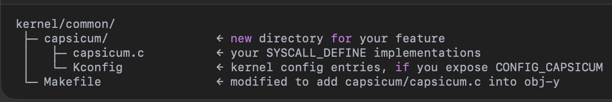

# Capsicum-integration-into-Android-AOSP

In AOSP, 'device/vendor/...' is part of the source tree, not something that only appears after build. It's where all of the device-specific resources lives--things like kernel configs, BoardConfig.mk, device-specific HALs, init scripts, and so on.

# Where to find 'device/vendor/' in Android-13_r35 aosp build
After running 'repo sync' (but before any build), We see at the top of AOSP checkout a directory called 'device/':

When you do 'lunch aosp_cf_x86_phone-userdebug' and select the build target, you're choosing the Cuttlefish target, which lives under 'device/google/cuttlefish/'. All of your device-specific build files--AndroidProducts.mk, BoardConfig.mk, device overlays, etc -- are in that directory.

Your custom library (libcapsicum) must be placed in 'device/vendor/libcapsicum' so that Soong picks it up before it generates anything in 'out/'.

# Android Module (for libapsicum Native Library)
- A single-built unit in AOSP. It can be an app, a native library, a java service, an executable, or a HAL.
- Every Android Module is declared in exactly one Android.bp(for Soong)/Android.mk(for Kati).
- When we run the AOSP build, Soong will scan every directory, read each Android.bp/Android.mk, and produce all of those   dicrete artifacts.

# Create Android Module for Native Library (libcapsicum.cpp) & exposing it to the Android
### Step-1:
The file structure of Android Module will be:

Since I am targeting the Cuttlefish build of Android-13_r35, the file structure for libcapsicum module is:

This tells Soong exactly where your new native-library module lives.

### Step-2: Invoking the Build
- source build/envsetup.sh
- lunch aosp_cf_x86_64_phone-userdebug
- m libcapsicum

where
* 'source build/envsetup.sh': loads the 'lunch', 'm', and other helper commands.
* 'lunch aosp_cf_x86_64_phone-userdebug': picks the target(Cuttlefish x86_64 emulator, userdebug variant)
* 'm libcapsicum': builds only libacapsicum module.

### Step-3: What Soong does
- Scans th entire tree for Android.bp files (including the new one).
- Builds an in-memory module graph for every 'cc_shared_library', 'cc_binary', etc.
- Generates ninja builds rules in 'out/soong/build.ninja' (and per-product manifests under 'out/target/product/aosp_cf_x86_64_phone/obj/').

### Step-4: PRODUCT_PACKAGES and final staging
- We can see the product list in 'device/google/cuttlefish/AndroidProducts.mk or device.mk'.
- We find a 'PRODUCT_PACKAGES += libcapsicum' (or we'll need to add it). This is what tells the build system 'stage libcapsicum.so' into final 'system.img'(or vendor.img).

### Step-5: Ninja does the work
- Ninja reads the generated .ninja files.
- It compiles 'libcapsicum.cpp' -> libcapsicum.so, links -> libcapsicum.so.
- Once built, Soong stages that .so into 'out/target/product/aosp_cf_x86_64_phone/system/lib64/' (for 64-bit libraries).

### Step-6: Loading in Java/Kotlin
- We can load the native library in 'capabilityManager.java' file for further action.

# Work Against libcapsicum.cpp

### Step-1: Placeholders for syscall numbers
(https://android.googlesource.com/kernel/msm/+/refs/heads/android-msm-wahoo-4.4-pie-r2/Documentation/adding-syscalls.txt)

* Path: (https://android.googlesource.com/kernel/common/+/refs/heads/android13-5.10/arch/x86/entry/syscalls/)

*    #define SYS_cap_new    350
*    #define SYS_cap_enter  352

We eventually need to verify and replace these with actual sys call numbers defiend in kernel modifications.
- Path-1: arch/x86/entry/syscalls/syscall_64.tbl
- Path-2: arch/x86/entry/syscalls/syscall_32.tbl

Open the above two tables and look at the highest numbered entry to choose next free numbers.

In 'arch/x86/entry/syscalls/syscall_64.tbl',
*   334     common  cap_new     SYS_cap_new
*   335     common  cap_enter   SYS_cap_enter

In 'arch/x86/entry/syscalls/syscall_32.tbl'
*   381     i386    cap_new     SYS_cap_new
*   382     i386    cap_enter   SYS_cap_enter

### Step-2: Generic system call implementation
#### a. Define the syscall entry point (capsicum)
* Path: (https://android.googlesource.com/kernel/common/+/refs/heads/android13-5.10/kernel/)

- 'kernel/common' : is the GKI(Generic Kernel Image) source used by all architectures. Putting it in common means your syscall lives in the shared kernel image that powers every device image.
- capsicum.c : Use the SYSCALL_DEFINEn() macro (where n is the number of argument)'
- Kconfig : Defines a new kernel configuration option named 'CAPSICUM_SYSCALLS'. Creates a boolean option (enable/disable) presented clearly to kernel when configuring. Also provides a brief explanation in the kernel config UI, describing the feature clearly.
- Makefile : To ensure that capsicum.o (compiled from capsicum.c) is included only when the kernel config option 'CONFIG_CAPSICUM_SYSCALL' is set to y.
- capsicum.o : Indicates the object file generated from source file (capsicum.c) that implements the capsicum syscalls.

* Place the whole file structure: '[kernel/common/android_version/kernel](https://android.googlesource.com/kernel/common/+/refs/heads/android13-5.10/kernel)'

#### b. Declare the Prototype
* Path: (https://android.googlesource.com/kernel/common/+/refs/heads/android13-5.10/include/linux/syscalls.h)

    asmlinkage long SYS_cap_new(arg1_type, arg2_type, ....)
    asmlinkage long SYS_cap_enter(arg1_type, arg2_type, ....)

where asmlinkage is the calling convention for syscalls.

#### c. Hook into the generic syscall table 
* Path: (https://android.googlesource.com/kernel/common/+/refs/heads/android13-5.10/include/uapi/asm-generic/unistd.h)

* for 64-bit/generic
        #define __NR_cap_new 334
        #define __NR_cap_enter 335
        __SYSCALL(__NR_cap_new, SYS_cap_new)
        __SYSCALL(__NR_cap_enter, SYS_cap_enter)

* for 32-bit/generic
        #define __NR_cap_new 381
        #define __NR_cap_enter 382
        __SYSCALL(__NR_cap_new, SYS_cap_new)
        __SYSCALL(__NR_cap_enter, SYS_cap_enter)

#### d. Provide a fallback stub
* Path: (https://android.googlesource.com/kernel/common/+/refs/heads/android13-5.10/kernel/sys_ni.c)

- Kernel build that don't include this feature should still compile. In the above mentioned path add: 

        cond_syscall(SYS_cap_new)
        cond_syscall(SYS_cap_enter)

- This stub returns -ENOSYS if the syscall isn't enabled.

#### e. Make it configurable
* Path: (https://android.googlesource.com/kernel/common/+/refs/heads/android13-5.10/init/Kconfig)

To integrate the capsicum Kconfig into the broader kernel configuration, You must add below entry in the above mentioned path:

        source 'kernel/capsicum /Kconfig'

## Work Against libacapsicum.h
The libcapsicum.h header serves as the public interface for native capsicum library.

- It declares the signatures of the wrapper functions, so that any C/C++, JNI, or other native code can call them without knowing the underlying implementation details in libcapsicum.cpp.
- Only what's declared in the header is visible externally.
- To make this header discoverable by JNI, build rule in Android.bp use 'export_include_dirs'.

libcapsicum.h is the contract between capsicum syscall wrappers and the rest of the Android codebase--without it, consumers wouldn't know how to correctly invoke or integrate new capability mode functionality.

### Suitable place to put libcapsicum.h

The header should live alongside the library's sources in a place that Soong will pick up via 'export_include_dirs' setting in Android.bp.

## Work Against caprights.h