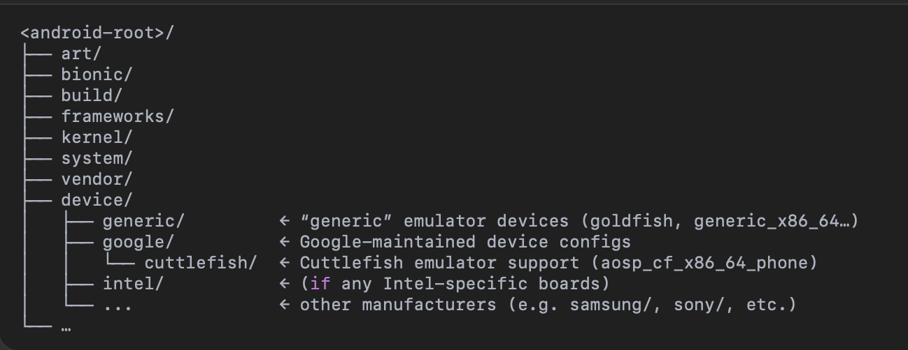
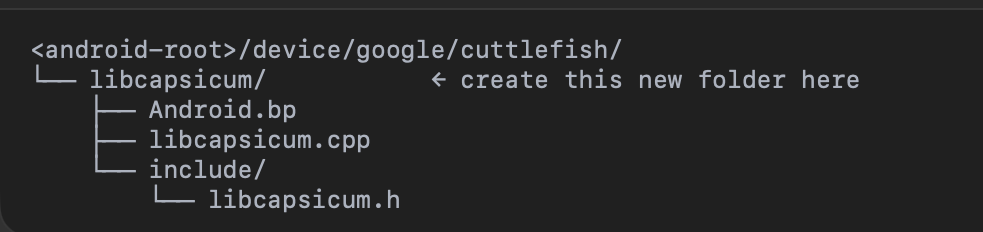

# Capsicum-integration-into-Android-AOSP

In AOSP, 'device/<vendor>/...' is part of the source tree, not something that only appears after build. It's where all of the device-specific resources lives--things like kernel configs, BoardConfig.mk, device-specific HALs, init scripts, and so on.

# Where to find 'device/<vendor>/' in Android-13_r35 aosp build
After running 'repo sync' (but before any build), We see at the top of AOSP checkout a directory called 'device/':

When you do 'lunch aosp_cf_x86_phone-userdebug' and select the build target, you're choosing the Cuttlefish target, which lives under 'device/google/cuttlefish/'. All of your device-specific build files--AndroidProducts.mk, BoardConfig.mk, device overlays, etc -- are in that directory.

Your custom library (libcapsicum) must be placed in 'device/<vendor>/libcapsicum' so that Soong picks it up before it generates anything in 'out/'.

# Android Module (for libapsicum Native Library)
- A single-built unit in AOSP. It can be an app, a native library, a java service, an executable, or a HAL.
- Every Android Module is declared in exactly one Android.bp(for Soong)/Android.mk(for Kati).
- When we run the AOSP build, Soong will scan every directory, read each Android.bp/Android.mk, and produce all of those   dicrete artifacts.

# Create Android Module for Native Library (libcapsicum.cpp) & exposing it to the Android
## Step-1:
The file structure of Android Module will be:

Since I am targeting the Cuttlefish build of Android-13_r35, the file structure for libcapsicum module is:

This tells Soong exactly where your new native-library module lives.

## Step-2: Invoking the Build
source build/envsetup.sh
lunch aosp_cf_x86_64_phone-userdebug
m libcapsicum

'source build/envsetup.sh': loads the 'lunch', 'm', and other helper commands.
'lunch aosp_cf_x86_64_phone-userdebug': picks the target(Cuttlefish x86_64 emulator, userdebug variant)
'm libcapsicum': builds only libacapsicum module.

## Step-3: What Soong does
- Scans th entire tree for Android.bp files (including the new one).
- Builds an in-memory module graph for every 'cc_shared_library', 'cc_binary', etc.
- Generates ninja builds rules in 'out/soong/build.ninja' (and per-product manifests under 'out/target/product/aosp_cf_x86_64_phone/obj/').

## Step-4: PRODUCT_PACKAGES and final staging
- We can see the product list in 'device/google/cuttlefish/AndroidProducts.mk or device.mk'.
- We find a 'PRODUCT_PACKAGES += libcapsicum' (or we'll need to add it). This is what tells the build system 'stage libcapsicum.so' into final 'system.img'(or vendor.img).

## Step-5: Ninja does the work
- Ninja reads the generated .ninja files.
- It compiles 'libcapsicum.cpp' -> libcapsicum.so, links -> libcapsicum.so.
- Once built, Soong stages that .so into 'out/target/product/aosp_cf_x86_64_phone/system/lib64/' (for 64-bit libraries).

## Step-6: Loading in Java/Kotlin
- We can load the native library in 'capabilityManager.java' file for further action.

